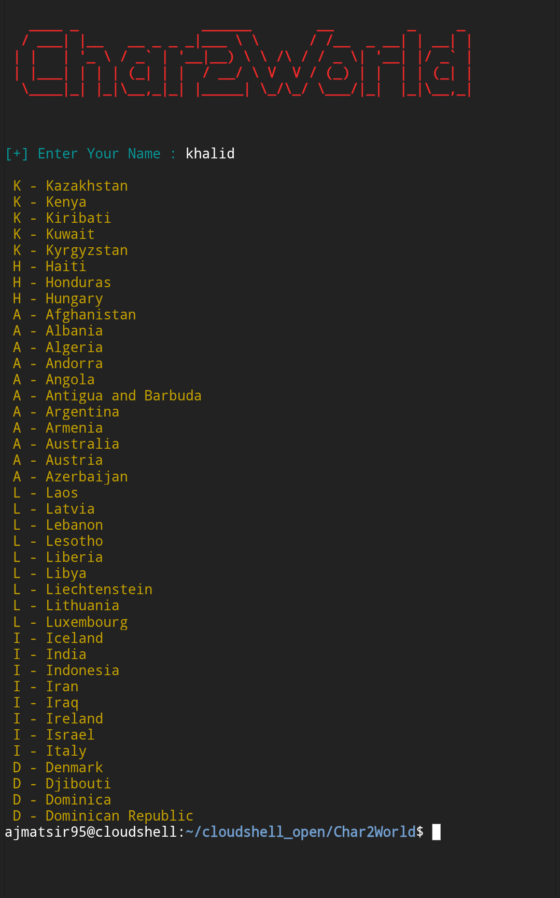

<p align="center">
  
  
  

</p>
<p align="center"><b>A beginners friendly, funny algebraic calculator</b></p>


> [!Warning]
> This script, char2world.py, begins its execution with the command **os.system("clear")**, which is designed to clear the entire contents of your terminal or console window before the logo and prompts are displayed. This means that any previous output, commands, or text in your current terminal session will be permanently erased when the script runs. Furthermore, please be aware that the script relies on the termcolor Python library to properly display the colorful logo and output. If you encounter errors, you may need to install this dependency by running the command pip install termcolor in your terminal.


## features 
- beginner friendly
- easy usable
- less time taken
- **automatic process**
- with letest version

## requirement.txt (file)
- installation commnads for tool requirements
```
pip install -r requirment.txt

os==3.13.7
termcolor==3.1.0
```

## Installation 
- just update and upgrade your Termux
```
apt update && apt upgrade -y
```
- should be install git pakage before installing this tool
```
pkg install git
```
- and install python pakage using python tool
```
pkg install python
```
- just clone this github repository 
```
git clone https://github.com/Cyber-Tech0/Char2World
```
- just enter in tool dictionary 
```
cd Char2World
```
- first of all install requirements of tool
```
pip install -r requirement.txt
```
- and give it executable permission
```
chmod +x char2world.py
```
- for run this tool and setup kali nethunter
```
python char2world.py
```
- On first launch, It'll install the dependencies and that's it is installed.

## Installation (one line)
> [!Tip]
> - if you want to setup **Char2World** in your Android. but you don't know terminal commands then you can copy and paste this commands on your terminal and **follow given below steps.**
> if you found any problems ⚠️ in running this tool, then first of all give permission to **char2world.py** file and run this file. then any Error came in run time then open this file in code editor and remove 2 and 4 line code only. and again run this tool. I sure this tool will be run.

- one line commands past on your Termux and just press hit enter.

```
apt update && apt upgrade -y && pkg install git -y && pkg install python -y && git clone https://github.com/Cyber-Tech0/Char2World && cd Char2World && pip install -r requirement.txt && chmod +x char2world.py && python char2world.py
```

### Termux Commands
> [!NOTE]
> if you don't know about Termux commands. then first of all you want to learn termux commands. if you are are interested then you can download PDF file and easily learn termux commands. [PDF download](https://drive.google.com/file/d/1kYllkvP2s27dxKE5QCRPkA3hNc5kGS1l/view?usp=drivesdk)


### open in cloud shell
<a href="https://shell.cloud.google.com/cloudshell/open?cloudshell_git_repo=https://github.com/Cyber-Tech0/Char2World.git&tutorial=README.md" target="_blank"></a>

<p></p>

### Algo Tool Interface
</img>

<p></p>
